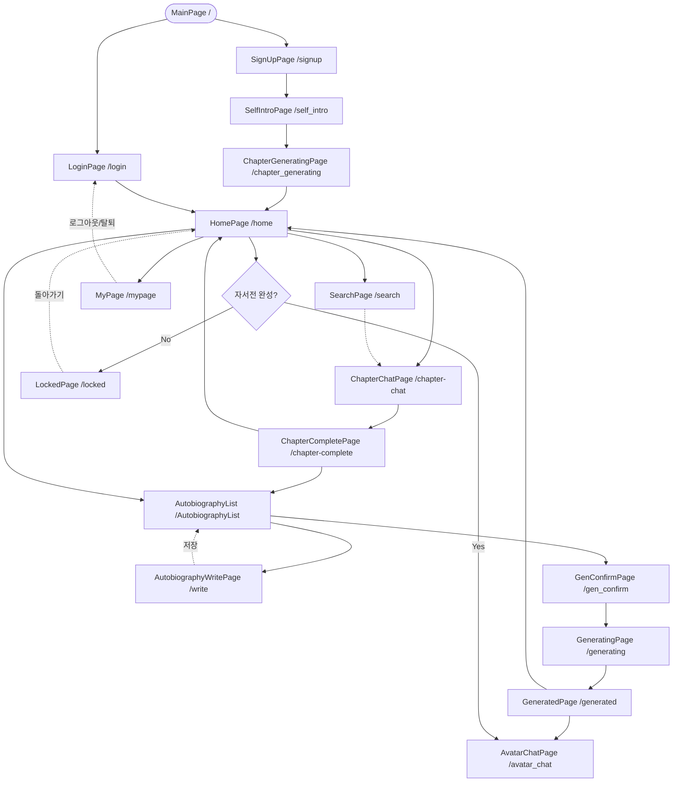
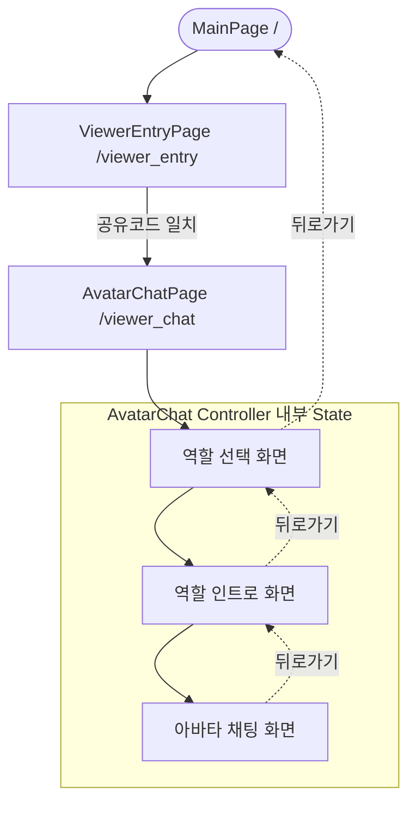

# Frontend Screen Flow (화면 구조 및 라우팅 흐름)

이 문서는 프론트엔드 프로젝트(`d:\DEV\projects\ai-life-legacy-front`)의 실제 `app_routes.dart`, `app_pages.dart` 및 각 화면의 라우팅 이동 로직을 기반으로 작성된 화면 흐름도 및 접근 제한 규칙 명세서입니다.

## 1. 전체 라우트 목록

| Route 이름 | Path | Page | Binding | 접근 모드 | 설명 |
|---|---|---|---|---|---|
| `main` | `/` | MainPage | - | 공통 | 앱 최초 진입 화면 (로그인/가입/뷰어코드 분기) |
| `login` | `/login` | LoginPage | AuthBinding | 작성자 | 작성자 로그인 화면 |
| `signup` | `/signup` | SignUpPage | AuthBinding | 작성자 | 작성자 회원가입 화면 |
| `home` | `/home` | HomePage | HomeBinding | 작성자 | 작성자 메인 대시보드 (목차 표시) |
| `search` | `/search` | SearchPage | HomeBinding | 작성자 | 홈 화면 내 챕터/질문 검색 기능 |
| `selfIntro` | `/self_intro` | SelfIntroPage | OnboardingBinding | 작성자 | 가입 직후 초기 자기소개 입력 화면 (채팅 형태) |
| `chapterGenerating` | `/chapter_generating` | ChapterGeneratingPage | - | 작성자 | 자기소개 제출 후 목차 생성 대기 로딩 화면 |
| `chapterChat` | `/chapter-chat` | ChapterChatPage | AutobiographyBinding | 작성자 | 챕터(목차) 내 세부 질문에 답변하는 채팅 형태 화면 |
| `chapterComplete` | `/chapter-complete` | ChapterCompletePage | - | 작성자 | 특정 챕터의 답변이 완료되었을 때 표시되는 축하/안내 화면 |
| `autobiography` | `/AutobiographyList` | AutobiographyListPage | AutobiographyBinding | 작성자 | 전체 자서전 답변 리스트 및 자서전 생성 기능 진입점 |
| `write` | `/write` | AutobiographyWritePage | AutobiographyBinding | 작성자 | 작성된 답변 단건 수정 화면 |
| `genConfirm` | `/gen_confirm` | GenConfirmPage | AutobiographyBinding | 작성자 | 자서전 PDF 생성 전 최종 확인 화면 |
| `generating` | `/generating` | GeneratingPage | - | 작성자 | 자서전 PDF 생성 중 대기 로딩 화면 |
| `generated` | `/generated` | GeneratedPage | - | 작성자 | 자서전 PDF 생성 완료 결과 제공 및 아바타 잠금 해제 안내 화면 |
| `locked` | `/locked` | LockedPage | - | 작성자 | 자서전 미완성 상태에서 아바타 채팅 진입 시 보여주는 차단/안내 화면 |
| `myPage` | `/mypage` | MyPage | MyPageBinding | 작성자 | 마이페이지 (알림 설정, 로그아웃, 회원탈퇴) |
| `viewerEntry` | `/viewer_entry` | ViewerEntryPage | ViewerBinding | 뷰어 | 6자리 뷰어 공유 코드를 입력하는 로그인 화면 |
| `viewerChat` | `/viewer_chat` | AvatarChatPage | AvatarChatBinding | 뷰어 | 뷰어 전용 아바타 채팅 화면 |
| `avatarChat` | `/avatar_chat` | AvatarChatPage | AvatarChatBinding | 작성자 | 작성자 전용 아바타 채팅 화면 (자서전 완성 후) |

*(참고: `dashboard`, `complete`, `completion`, `viewerRole`, `viewerAudio` 라우트도 선언되어 있으나, 현재 메인 비즈니스 흐름 상 직접적인 화면 이동에 사용되지 않거나 내부 State로 편입되어 있습니다.)*

---

## 2. 작성자 모드 화면 흐름

작성자(Writer) 모드의 생애주기 흐름은 다음과 같습니다.

1. **시작 및 온보딩**
   - **`Main`** ➔ **`SignUp`** ➔ **`SelfIntro`** (자기소개 입력) ➔ **`ChapterGenerating`** (로딩 3초) ➔ **`Home`**
   - 기존 사용자는 **`Main`** ➔ **`Login`** ➔ **`Home`**

2. **챕터 질문/답변 작성**
   - **`Home`** ➔ **`ChapterChat`** (각 챕터 질문 답변) ➔ **`ChapterComplete`** (챕터 완료)
   - 챕터 완료 후 ➔ **`Home`** 또는 **`AutobiographyList`** 로 이동

3. **자서전 생성 및 아바타 잠금 해제**
   - **`Home`** ➔ **`AutobiographyList`** (답변 수정 필요 시 **`Write`** 다녀옴)
   - **`AutobiographyList`** ➔ **`GenConfirm`** ➔ **`Generating`** ➔ **`Generated`** (PDF 발간 및 아바타 언락)
   - 완료 화면에서 **`AvatarChat`** 혹은 **`Home`** 으로 복귀

4. **아바타 채팅 진입 시도**
   - **`Home`** ➔ **`AvatarChat`** 버튼 터치
   - (조건) 자서전이 아직 생성되지 않았다면 ➔ **`Locked`** 페이지로 강제 이동
   - (조건) 자서전 생성이 완료되었다면 ➔ **`AvatarChat`** 정상 진입

5. **기타**
   - **`Home`** ➔ **`MyPage`** ➔ 로그아웃/탈퇴 시 ➔ **`Login`** 으로 강제 이동

---

## 3. 뷰어 모드 화면 흐름

뷰어(Viewer) 모드는 작성자의 초대를 받은 사용자가 아바타와 대화하기 위한 단순화된 흐름을 가집니다.

1. **뷰어 진입 및 인증**
   - **`Main`** ➔ **`ViewerEntry`** (코드 입력)
   - 코드 인증 성공 ➔ **`ViewerChat`** (`/viewer_chat`) 경로로 즉시 이동

2. **뷰어 채팅 내부 흐름 (AvatarChatController State 제어)**
   - 페이지 이동 없이 컨트롤러 내부의 `step` 상태값을 통해 화면이 전환됩니다.
   - **`Role Select`** (역할 선택) ➔ **`Intro`** (인사말) ➔ **`Chat`** (채팅 진행)
   - 뒤로가기 시 Chat ➔ Intro ➔ Role Select ➔ **`Main`** 으로 복귀

---

## 4. 접근 제한 규칙

- **자서전 미완성 시 아바타 진입 차단 (작성자)**: 
  작성자가 `/avatar_chat` 진입 시, `AvatarChatController`에서 `autoBioController.isUnlocked` 상태를 검증합니다. 완성되지 않은 상태라면 즉시 `Get.offNamed(Routes.locked)`를 호출하여 접근을 차단합니다.
  
- **뷰어 모드에서 작성자 기능 숨김**: 
  뷰어로 인증된 세션(TokenStorage에 `viewerAccessToken` 존재, `isViewerMode == true`)인 경우, `/viewer_chat` 외의 다른 라우트(예: `/avatar_chat`)에 접근하려 하면 `AvatarChatController`가 감지하여 `Get.offAllNamed(Routes.viewerChat)`로 리다이렉트 시킵니다. 또한 홈의 기능들(`HomeController.fetchToc`)은 뷰어 모드일 때 동작하지 않습니다.

- **작성자 모드에서 뷰어 채팅 강제 진입 차단**: 
  작성자 세션(뷰어 모드가 아님)에서 `/viewer_chat` URL로 잘못 진입할 경우, 컨트롤러 내부 방어 로직에 의해 `Get.offAllNamed(Routes.home)`으로 리다이렉트되어 뷰어 전용 화면에 머무르지 못하게 합니다.

---

## 5. Mermaid Flowchart

### 작성자 플로우 (Writer Flow)

### 뷰어 플로우 (Viewer Flow)

